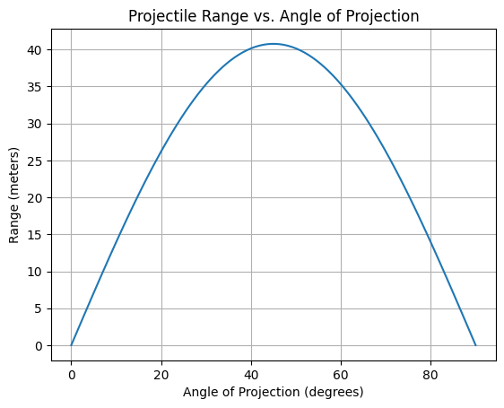

# Problem 1
**1. Theoretical Foundation**

Projectile motion follows Newtonian mechanics and can be described by kinematic equations. The motion can be broken down into horizontal and vertical components:

Horizontal motion:

$$x = v_0 \cos(\theta) \cdot t$$

Vertical motion: 

$$y = v_0 \sin(\theta) \cdot t - \frac{1}{2}gt^2$$

To derive the range equation, we determine the time of flight by solving for when the projectile returns to the ground $(y = 0):$

$$t_f=\frac{2v_0sin(\theta)}{g}$$

Substituting into the horizontal motion equation gives:

$$R=\frac{2v_0sin(2\theta)}{g}$$

This equation shows that range depends on initial velocity, gravitational acceleration, and the angle of projection.

**2. Analysis of the Range**

- The range is maximized at $45°$ when air resistance is neglected.
- For fixed initial velocity, increasing gravity decreases range.
- The range exhibits symmetry: $R(0)=R(90-\Theta)$

**3. Practical Applications**

- Sports: Ball trajectories in soccer, basketball, and golf.

- Engineering: Projectile launchers, artillery, and space missions.

- Environmental Effects: Air resistance and wind influence projectile motion.

**4. Limitations and Extensions**

Neglecting Air Resistance: Real-world projectiles experience drag.

Uneven Terrain: Some projectiles land at different heights.

Spin Effects: Magnus force influences trajectories in sports.

Further simulations could incorporate drag, wind, or variable terrain to enhance realism.

