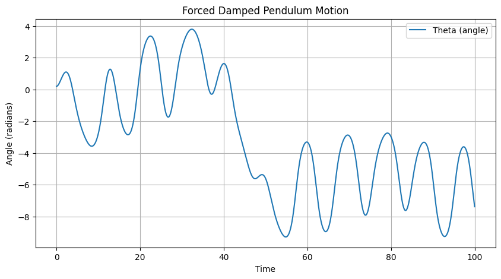

# Problem 2

**1. Theoretical Foundation**

*The Differential Equation:*
- The starting point is Newton's second law for rotational motion. The torque acting on the pendulum is the sum of the restoring torque due to gravity, the damping torque, and the external driving torque.

- Mathematically:
- $τ = Iα$

- Where $τ$ is the total torque, I is the moment of inertia $(mL²)$, and $α$ is the angular acceleration $(θ'')$

- The restoring torque is $-mgLsin(θ)$

- The damping torque is $-bL²θ'$

- The driving torque is $mL²Acos(ωt)$

- Combining these, we get: 

$$mL²θ'' = -mgLsin(θ) - bL²θ' + mL²Acos(ωt)$$

- Dividing by $mL²$ yields:

$$θ'' + (b/m)θ' + (g/L)sin(θ) = Acos(ωt)$$

- *Small-Angle Approximation:*

For small angles, we use the Taylor series expansion of $sin(θ):$

- $sin(θ) = θ - θ³/3! + θ⁵/5! - ...$

- For $θ << 1$, we can approximate $sin(θ) ≈ θ$, simplifying the equation to:

$$θ'' + (b/m)θ' + (g/L)θ = Acos(ωt)$$

This approximation linearizes the equation, making it solvable using standard techniques.

- *General Solution (Linearized Equation):*

- The general solution is the sum of the homogeneous solution $(θh)$ and the particular solution $(θp)$.

- *Homogeneous Solution (θh):*

This solves the equation $θ'' + γθ' + ω₀²θ = 0$, where $γ = b/m$ and $ω₀² = g/L$

- The characteristic equation is $r² + γr + ω₀² = 0$, with roots:

$$r = (-γ ± √(γ² - 4ω₀²)) / 2$$

- The nature of the roots determines the form of θh:

- Overdamped $(γ² > 4ω₀²): θh = C₁e^(r₁t) + C₂e^(r₂t)$

- Critically damped $(γ² = 4ω₀²): θh = (C₁ + C₂t)e^(-γt/2)$

- Underdamped $(γ² < 4ω₀²): θh = e^(-γt/2)(C₁cos(ωd t) + C₂sin(ωd t)), where ωd = √(ω₀² - γ²/4)$

- Particular Solution (θp):

- We assume a solution of the form $θp = Ccos(ωt) + Dsin(ωt)$

- Substituting this into the differential equation and solving for C and D gives:

$$C = A(ω₀² - ω²) / ((ω₀² - ω²)² + (γω)²)$$

$$D = Aγω / ((ω₀² - ω²)² + (γω)²)$$

This can be rewritten as:

$$θp = (A / √((ω₀² - ω²)² + (γω)²)) * cos(ωt - φ)$$

- Where $φ = arctan(γω / (ω₀² - ω²))$

- *Resonance:*
-Resonance occurs when the driving frequency $(ω)$ is close to the natural frequency $(ω₀)$

- The amplitude of θp is maximized when the denominator of the amplitude term is minimized.

- This occurs when $ω ≈ √(ω₀² - γ²/2)$

- The peak amplitude is:

$$Amplitude = A / (γ√(ω₀² - γ²/4))$$

- The sharper the resonance peak, the smaller the gamma value is.

2. *Analysis of Dynamics (Textual Explanation)*

- **Damping (γ):**

- High damping leads to rapid dissipation of energy, resulting in smaller oscillation amplitudes and faster settling to steady-state.

- Low damping allows for larger amplitudes, especially near resonance, and slower decay of transient oscillations.

- Zero damping results in undamped oscillations with constant amplitude.

- **Driving Amplitude (A):**

- The driving amplitude directly scales the amplitude of the steady-state oscillations. 

- At high amplitudes, the small-angle approximation breaks down, and nonlinear effects become significant.

**Driving Frequency (ω):**

- Varying the driving frequency around the natural frequency (ω₀) leads to resonance phenomena.

- The closer $ω$ is to $ω₀$, the larger the oscillation amplitude becomes.

- Far from $ω₀$, the amplitude decreases.

- When the driving frequency is varied, and the other parameters allow for chaotic behaviour, the pendulum can change between periodic, and chaotic motion.

- **Transition to Chaos:**

- For large driving amplitudes and low damping, the pendulum can exhibit chaotic behavior.

- This is due to the nonlinearity of the sin(θ) term.

- Chaotic motion is characterized by:

- Sensitive dependence on initial conditions (butterfly effect).

- Unpredictable long-term behavior.

- Broad frequency spectrum.

- Poincare sections allow for the visualization of the attractors of the systems, and the change from simple attractors to strange attractors, which are a strong indicator of chaotic motion.

- Bifurcation diagrams are created by plotting the final stable value of the angle of the pendulum after a long simulation, while changing one parameter, like the driving force. This allows for the visualization of the points where the stable state of the pendulum changes.

**3. Practical Applications**

- Energy Harvesting: Pendulums can be used to convert ambient vibrations into electrical energy. Resonance is exploited to maximize energy capture.

- Suspension Bridges: Understanding resonance is crucial to prevent catastrophic failures due to wind-induced oscillations.

- Oscillating Circuits (RLC Circuits): The forced damped pendulum is analogous to a driven RLC circuit, where resonance and damping play similar roles.

- Mechanical Systems: Vibration isolation, engine mounts, and other mechanical systems benefit from understanding forced damped oscillations.

- Human Gait: The human gait can be modeled as a series of coupled oscillators, with damping and forcing playing crucial roles.

