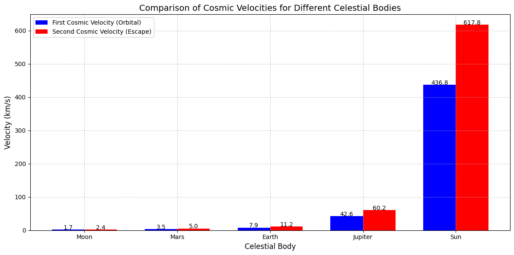

# Problem 2

**Escape Velocities and Cosmic Velocities**

-  Introduction

Escape velocity is the minimum speed an object must attain to break free from a celestial body's gravitational pull without further propulsion. The concept extends to cosmic velocities, which define critical speed thresholds for space missions:

- **First Cosmic Velocity (Orbital Velocity):** The speed needed to maintain a stable orbit around a body.

- **Second Cosmic Velocity (Escape Velocity):** The speed required to escape a body's gravitational field entirely.

- **Third Cosmic Velocity (Interstellar Escape Velocity):** The speed needed to leave a star system (e.g., the Solar System).

These velocities are foundational in space exploration, determining satellite launches, interplanetary missions, and potential interstellar travel.

**Mathematical Derivation of Escape Velocity**

The escape velocity $(v_\text{esc})$ is derived from the balance between an object's kinetic energy and the gravitational potential energy needed to overcome a planet's gravity.

**Gravitational Potential Energy (U)**

The work required to move an object of mass $m$ from the surface (radius R) to infinity is:

$$U = \frac{GMm}{R}$$

where:

$G$ = Gravitational constant $(6.674 \times 10^{-11} \, \text{m}^3 \, \text{kg}^{-1} \, \text{s}^{-2})$

$M$ = Mass of the celestial body

$R$ = Radius of the celestial body

**Kinetic Energy (K)**

To escape, the object must have sufficient kinetic energy to counteract 
$U$:

$K = \frac{1}{2}mv_{\text{esc}}^2$

**Equating and Solving for $(v_\text{esc})$**

Setting $K=U:$

$$\frac{1}{2}mv_{\text{esc}}^2 = \frac{GMm}{R}$$

$$v_{\text{esc}} = \sqrt{\frac{2GM}{R}}$$

**The Three Cosmic Velocities**

$(a)$ First Cosmic Velocity (Orbital Velocity, $v_1$)

The minimum speed for a stable circular orbit near a planet’s surface (ignoring atmospheric drag):

$$v_1 = \sqrt{\frac{GM}{R}}$$

**Physical Meaning:** Satellites (e.g., the ISS) must reach this speed to avoid falling back to Earth.

**$(b)$ Second Cosmic Velocity (Escape Velocity,$v_2$)**

The speed needed to leave a planet's gravitational influence:

$$v_2 = \sqrt{\frac{2GM}{R}} = \sqrt{2} . v_1$$

**Physical Meaning:** Spacecraft (e.g., Apollo missions) must exceed this to reach the Moon or other planets.

**$(c)$ Third Cosmic Velocity (Interstellar Escape,$v_3$)**

The speed required to escape the Solar System from Earth’s orbit (~42 km/s relative to the Sun).

$$v_3 = \sqrt{v_{\text{esc},\odot}^2 + v_{\text{orb},\oplus}^2}$$

where:

$v_{\text{esc},\odot}$ = Escape velocity from the Sun at Earth's orbit (~42.1 km/s)

$v_{\text{orb},\oplus}$ = Earth's orbital speed (~29.8 km/s)

**Physical Meaning:** Probes like Voyager 1 must reach this to exit the Solar System.

**Parameters Affecting Escape Velocities**

The escape velocity depends on:

**Mass $(M)$:** More massive planets require higher escape speeds (e.g.,Jupiter's $v_{\text{esc}}=59.5km/s$).

**Radius $(R)$:** Larger planets may have lower escape velocities if their mass is distributed over a bigger volume (e.g., Saturn's $v_{\text{esc}} =35.5km/s$).

**Examples for Celestial Bodies**

----------------------------------------------------------------------------------

**Body:** **EARTH**

**Mass $(M)$** : $5.97 x 10^24kg$

**Radius $(R)$** : 6,371km

**$v_1$** **(km/s)**: 7.9

**$v_2$** **(km/s)** : 11.2
----------------------------------------------------------------------------------

**Body:** **MARS**

**Mass $(M)$** : $6.39 x 10^23kg$

**Radius $(R)$** : 3,390km

**$v_1$** **(km/s)** : 3.6

**$v_2$ (km/s)** : 5.0

---------------------------------------------------------------------------------
**Body:** **JUPITER**

**Mass $(M)$** : $1.90 x 10^27kg$

**Radius $(R)$** : 69,911km

**$v_1$(km/s)** : 42.1

**$v_2$ (km/s)** : 59.5

-------------------------------------------------------------

**Earth:** Satellites need ~7.9 km/s to orbit; Moon missions require ~11.2 km/s.

**Mars:** Lower escape velocity (5.0 km/s) makes landing and takeoff easier than on Earth.

**Jupiter:** Extremely high $v_2$ (59.5 km/s) makes direct escape nearly impossible for current spacecraft.

**Importance in Space Exploration**

 - Satellite Launches:

 The first cosmic velocity determines the speed for Low Earth Orbit (LEO) satellites.

 - Interplanetary Missions:

 The second cosmic velocity is critical for missions to Mars (e.g., Perseverance Rover).

 - Interstellar Travel:

 The third cosmic velocity is essential for probes like Voyager 1 and future star-bound missions.

**Graphical Representation**

A comparison between first cosmic velocity (orbital) and second cosmic velocity 

**Extensions and Limitations**

- Non-spherical Bodies: Irregular shapes (e.g., asteroids) require adjustments.

- Atmospheric Drag: Real-world launches need extra thrust to overcome air resistance.

- Relativistic Effects: Near light speed, Einstein’s corrections apply (unlikely for current tech).

**Conclusion**

Escape and cosmic velocities are fundamental to spaceflight, dictating mission feasibility and energy requirements. From deploying satellites to planning interstellar voyages, these principles shape humanity’s reach into the cosmos. Future advancements in propulsion (e.g., fusion drives) may redefine these limits, but the underlying physics remains anchored in Newtonian gravity.

