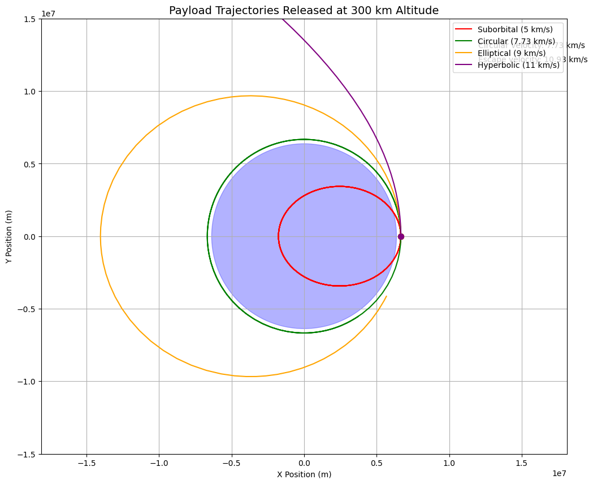

# Problem 3

# Trajectories of a Freely Released Payload Near Earth

**Introduction**

When a payload is released from a moving rocket near Earth, its subsequent trajectory is determined by the fundamental principles of orbital mechanics. The path the payload follows depends critically on its initial position, velocity vector, and the gravitational influence of Earth. This analysis explores the possible trajectories—elliptical, parabolic, and hyperbolic—and their implications for space mission scenarios such as orbital insertion, atmospheric reentry, or escape from Earth's gravitational influence.

# Fundamental Physics

**Newton's Law of Universal Gravitation**

The gravitational force between Earth (mass $M$) and the payload (mass $m$) is given by:

$$F = -G \frac{Mm}{r^2} \hat{r}$$

where:

$G = 6.67430 \times 10^{-11} \, \text{m}^3 \, \text{kg}^{-1} \, \text{s}^{-2}$ (gravitational constant)

$r =$ distance between Earth's center and the payload

$\hat{r} = $ unit vector pointing from Earth's center to the payload

**Equations of Motion**

Using Newton's second law, the acceleration of the payload is:

$$a = \frac{F}{m} = \vec{g} = -\frac{GM}{r^2} \hat{r}$$

In Cartesian coordinates (with Earth at the origin), this becomes a system of differential equations:

$$\frac{d^2x}{dt^2} = -\frac{GMx}{(x^2 + y^2 + z^2)^{3/2}}$$

$$\frac{d^2y}{dt^2} = -\frac{GMy}{(x^2 + y^2 + z^2)^{3/2}}$$

$$\frac{d^2z}{dt^2} = -\frac{GMz}{(x^2 + y^2 + z^2)^{3/2}}$$

For simplicity, we'll consider 2D motion in the xy-plane.

**Specific Orbital Energy**

The shape of the orbit is determined by the specific orbital energy $(ε)$:

$$\epsilon = \frac{v^2}{2} - \frac{GM}{r}$$

where v is the payload's velocity magnitude. The orbit type depends on ε:

- $ε < 0$: Elliptical orbit (bound)

- $ε = 0$: Parabolic trajectory (escape exactly)

- $ε > 0$: Hyperbolic trajectory (escape with excess energy)

**Angular Momentum and Orbit Shape**

The specific angular momentum $(h)$ is conserved:

$$h=r×v$$

The magnitude h determines the orbit's eccentricity $(e)$:

$$e = \sqrt{1 + \frac{2\epsilon h^2}{G^2M^2}}$$

**Initial Conditions and Trajectory Analysis**

When a payload is released at altitude h above Earth's surface with initial velocity $\mathbf{v}_0 = (v_{x0}, v_{y0})$ , we calculate:

Initial position: $r₀ = R + h$ where $R$ = Earth's radius (~6,371 km)

Initial velocity magnitude: $v₀ = √(v_{x0}² + v_{y0}²)$

Flight path angle: $γ =$ atan $2(v_{y0}, v_{x0})$

**Critical Velocities**

Circular orbit velocity at radius r:

$$v_{\text{circ}} = \sqrt{\frac{GM}{r}}$$

Escape velocity (parabolic trajectory):

$$v_{\text{esc}} = \sqrt{\frac{2GM}{r}}$$

**Possible Scenarios**

Suborbital (Elliptical impact trajectory):

- $v₀ < v_circ$

- Payload falls back to Earth (reentry)

**Circular orbit:**

- $v₀ = v_circ$ with $γ = 0$ (perfectly horizontal)

**Elliptical orbit:**

- v_circ < v₀ < v_esc

**Escape trajectory:**

- v₀ ≥ v_esc

**Numerical Solution Approach**

To compute the trajectory, we numerically integrate the equations of motion using methods like the Runge-Kutta 4th order (RK4):

For each time step Δt:

- Compute acceleration components $aₓ, a_y$

- Update velocity: $vₓ += aₓΔt, v_y += a_yΔt$

- Update position: $x += vₓΔt, y += v_yΔt$

**Example Simulation Parameters**

Consider a payload released at:

- Altitude: 300 km (r = 6,671 km)

- Initial velocities (all cases start with purely horizontal velocity):

**Suborbital:**

v₀ = 5 km/s (< 7.73 km/s circular)

**Circular orbit:**

v₀ = 7.73 km/s

**Elliptical orbit:**

v₀ = 9 km/s

**Escape:**

v₀ = 11 km/s (> 10.9 km/s escape)

**Graph Example**

**Results and Visualization**

The trajectories would show:

- Suborbital: Steep parabola intersecting Earth

- Circular: Perfect circle around Earth

- Elliptical: Oval-shaped orbit with perigee at release point

- Hyperbolic: Open curve departing Earth

**Applications**

Understanding these trajectories is crucial for:

- Satellite deployment (achieving desired orbits)

- Spacecraft reentry (controlled descent)

- Interplanetary missions (gravity assists, escape trajectories)

This analysis provides the foundation for mission planning and payload delivery in space operations. The same principles extend to orbital mechanics around any celestial body.

