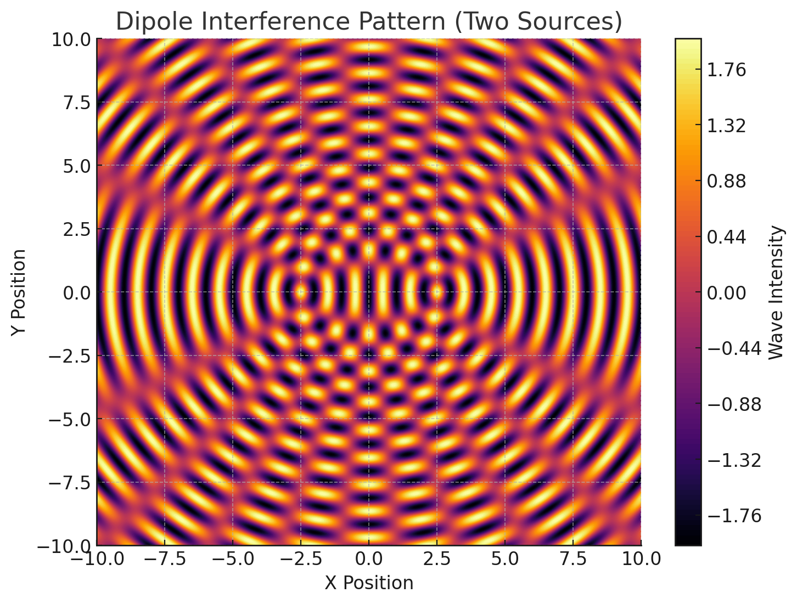
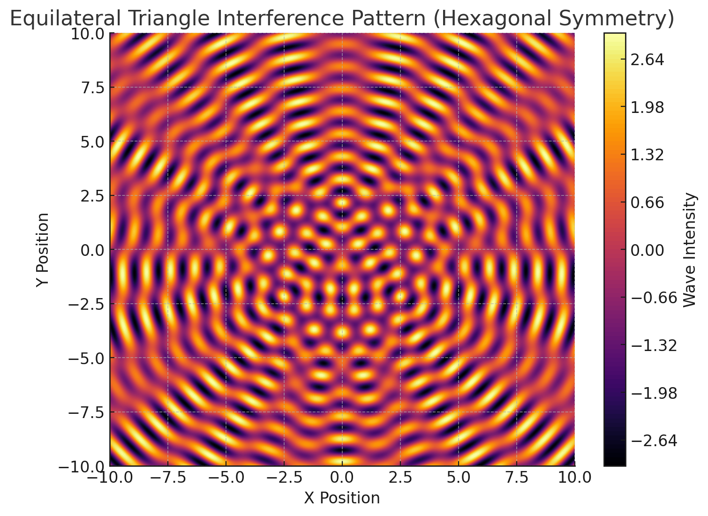
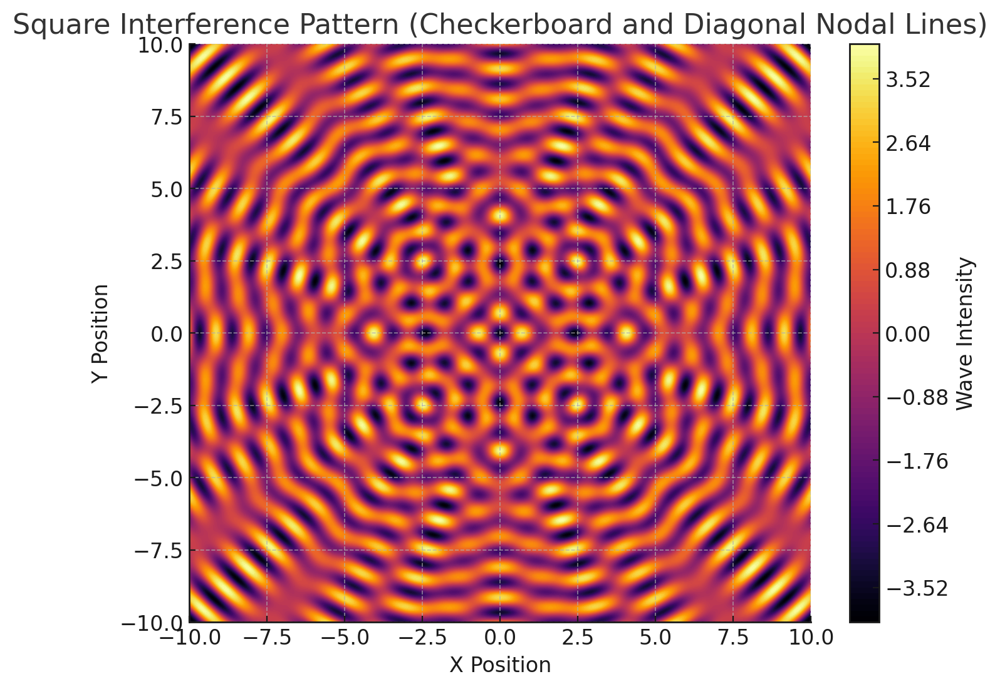
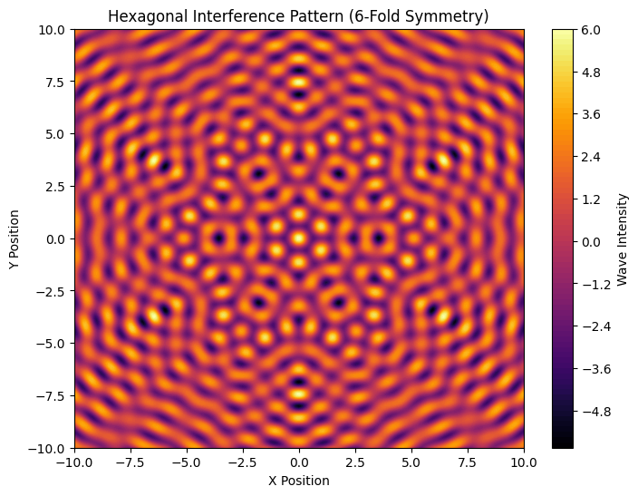

# Problem 1

# Interference Patterns from Regular Polygon Wave Sources

**Introduction**

When waves from multiple sources interact, they create intricate interference patterns due to superposition. Here, we analyze the patterns formed by N identical wave sources placed at the vertices of a regular polygon.

**Mathematical Framework**

**Wave Equation for a Single Source**

Each point source at position $(X_n,Y_n)$ generates a circular wave on the water surface:

$$\eta_n(x,y,t) = \frac{A}{\sqrt{r_n}} \cos(kr_n - \omega t + \phi_n)$$

**Where:**

- $A =$ wave amplitude

- $r_n = \sqrt{(x - x_n)^2 + (y - y_n)^2} = $ distance from source $n$ to point $(x,y)$

- $k = \frac{2\pi}{\lambda} \quad \text{where } k = \text{wavenumber and } \lambda = \text{wavelength}$

- $\omega = 2\pi f =$= angular frequency $(f=frequency)$

- $\phi_n =$ phase of source $n$

**Superposition of Waves**

The total displacement at any point $(x,y)$ is the sum of waves from all $N$ sources:

$$\eta_{\text{total}}(x,y,t) = \sum_{n=1}^{N} \eta_n(x,y,t) = \sum_{n=1}^{N} \frac{A}{\sqrt{r_n}} \cos(kr_n - \omega t + \phi_n)$$

**Regular Polygon Configuration**

For an $N-sided$ polygon centered at the origin with radius $R$, the positions of the sources are:

$$x_n = R \cos\left(\frac{2\pi n}{N}\right), \quad y_n = R \sin\left(\frac{2\pi n}{N}\right), \quad n = 0, 1, 2, \ldots, N-1$$

**Interference Analysis**

Constructive Interference (Maxima)

Waves add up when their phases align:

$$kr_1 - \omega t + \phi_1 = kr_2 - \omega t + \phi_2 = \cdots = kr_N - \omega t + \phi_N + 2\pi m$$

For identical phases $\phi_n = \phi$ this simplifies to:

$$r_1 \approx r_2 \approx \cdots \approx r_N + m\lambda \quad (m \in \mathbb{Z})$$

These regions appear as bright spots where waves reinforce each other.

**Destructive Interference (Minima)**

Waves cancel out when they are out of phase. For two sources, complete cancellation occurs when:

$$k(r_1 - r_2) + (\phi_1 - \phi_2) = \pi + 2\pi m$$

For $N$ sources, cancellation is more complex but happens where the sum of waves is zero.

**Resulting Interference Patterns**

**Key Features:**

- Symmetry → $N-fold$ rotational symmetry $(e.g., hexagonal for N=6)$

- Nodal Lines → Lines where waves cancel $(\eta_{\text{total}} \approx 0)$

- Antinodal Regions → Areas of maximum wave amplitude

- Amplitude Decay → Falls as $\frac{1}{\sqrt{r}}$ from each source

**Time Evolution & Intensity**

The pattern oscillates with frequency $f$, but the time-averaged intensity is:

$$I(x,y) \propto \langle \eta_{\text{total}}^2 \rangle = \sum_{n=1}^{N} \frac{A^2}{r_n} + 2 \sum_{n<m} \frac{A^2}{\sqrt{r_n r_m}} \cos(k(r_n - r_m) + (\phi_n - \phi_m))$$

**Graph Example**

- (Dipole)	Hyperbolic nodal lines, classic two-source interference

- (Equilateral Triangle)	Hexagonal symmetry in far field

- (Square)	Strong diagonal nodal lines, checkerboard-like maxima

- (Hexagon)	Complex flower-like pattern with 6-fold symmetry

**Conclusion**

- The number of sides $(N)$ determines the symmetry of the pattern.

- The wavelength $(λ)$ controls the spacing of interference fringes.

- Applications: Antenna arrays, acoustics, quantum wave interference.

