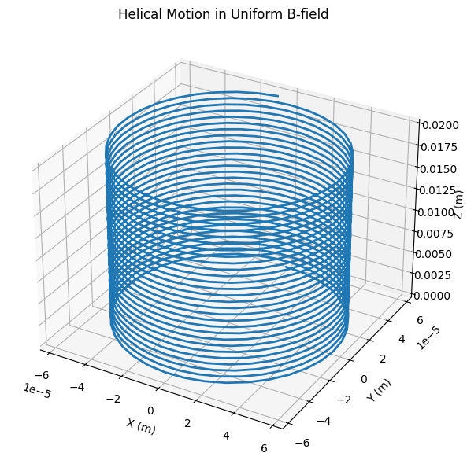

# Problem 1

**Introduction to the Lorentz Force**

The Lorentz force describes the combined influence of electric and magnetic fields on a charged particle:

$$F = qE + qv \times B$$

where:

- **F** = Force acting on the particle (N)

- **q** = Charge of the particle (C)

- **E** = Electric field (V/m)

- **v** = Velocity of the particle (m/s)

- **B** = Magnetic field (T)

This force governs the motion of charged particles in plasma physics, particle accelerators, mass spectrometers, and astrophysical systems (e.g., solar wind dynamics).

**Key Applications of the Lorentz Force**

**(a) Particle Accelerators (Cyclotrons, Synchrotrons)**

**Magnetic Field Role**: Confines particles into circular orbits via centripetal Lorentz force.

**Electric Field Role**: Accelerates particles at gaps between "Dees" (in cyclotrons).

**(b) Mass Spectrometers**

**Principle:** Particles with different $\frac{q}{m}$ ratios follow distinct trajectories in a uniform B-field, allowing mass separation.

**(c) Plasma Confinement (Tokamaks)**

**Magnetic Fields:** Prevent plasma from contacting walls by inducing helical motion (see §3.2).

**(d) Astrophysical Phenomena**

**Charged Particle Trajectories:** Cosmic rays spiral along interstellar magnetic fields.

**Motion of Charged Particles in Different Field Configurations**

**Uniform Magnetic Field (E=0)**

The force reduces to:

$$F = qE + qv \times B$$

Trajectory: Circular or helical motion.

**Key Parameters:**

Larmor Radius (Gyroradius):

$$r_L = \frac{m v_\perp}{|q| B}$$

where v⊥ = velocity perpendicular to B.

Cyclotron Frequency:

$$\omega_c = \frac{|q|B}{m}$$

**Combined Uniform E and B Fields**

$\text{If } E \parallel B:$

Particle accelerates along $B$ while spiraling (helical trajectory).

$\text{If } E \perp B:$

Drift Velocity:

$$v_E = \frac{E \times B}{B^2}$$

(Particle drifts perpendicular to both fields.)

**$Crossed Fields (E⊥B)$**

Special Case: Hall Effect (charge carriers drift laterally in conductors).

Trajectory: Cycloidal (combination of circular and linear motion).

**Numerical Simulation Approach**
Equations of Motion

From Newton’s second law:

$$\frac{dv}{dt} = \frac{q}{m} (E + v \times B)$$

$$\frac{dr}{dt} = v$$

**Numerical Methods:**

Euler Method (simple but less accurate):

$$v_{n+1} = v_n + \frac{q}{m} (E + v_n \times B) \Delta t$$

Runge-Kutta (RK4) (higher precision):

Uses weighted averages of intermediate steps.

**Key Visualizations**

**Helical Motion (uniform B):**

3D plot of 
z-axis progression with circular xy-motion.

**Drift Motion $(E⊥B)$**

Curved trajectory with net drift perpendicular to both fields.

**Larmor Radius Variation:**

$\text{Plot } r_L \text{ vs. } B \text{ for fixed } v_\perp$

**Practical Implications**

**(a) Cyclotrons**

Resonance Condition: RF electric field matches $ω_c$.

Particle Energy:

$$E_k = \frac{q^2 B^2 r^2}{2m}$$

(where r = orbit radius).

**(b) Mass Spectrometers**

Ion Separation:

$$r = \frac{mv}{qB}$$

(heavier ions curve less).

**(c) Magnetic Mirrors (Fusion Devices)**

Principle: Non-uniform B-fields reflect particles via magnetic moment conservation.

**Extensions to Complex Scenarios**

**Non-Uniform Fields:**

Gradient-B drifts, curvature drifts.

**Relativistic Effects:**

$\text{For } v \approx c,m \to \gamma m_0$

**Multi-Particle Systems:**

Plasma simulations via Particle-in-Cell (PIC) methods.

**Graphical Representations**

**Helical Motion in Uniform Magnetic Field (3D Plot) python**

**E×B Drift in Crossed Fields (2D Plot)**

**Larmor Radius vs Magnetic Field Strength**

**Conclusion**

The Lorentz force dictates charged particle motion in laboratory, industrial, and cosmic environments. Simulations reveal:

Guiding center drifts in crossed fields.

Resonant acceleration in cyclotrons.

Mass-dependent trajectories in spectrometers.

Future directions could explore stochastic fields or quantum effects (e.g., Landau quantization).

