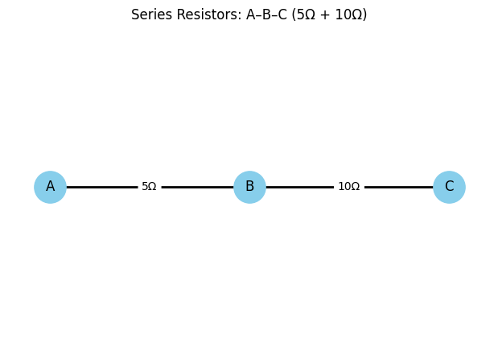
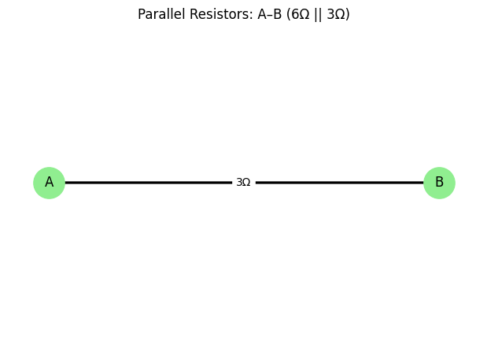
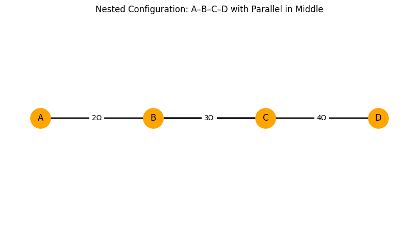
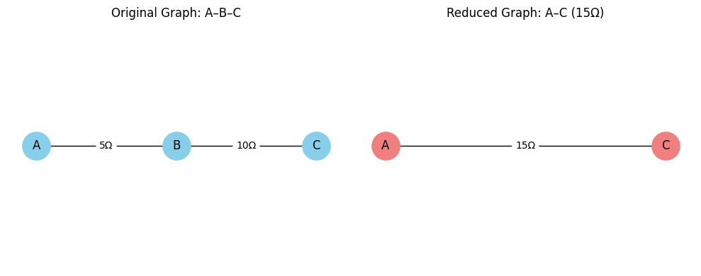

# Problem 1

# Problem 1

**Series Reduction**

Two resistors (edges) are in series if they share a common node with no other edges connected to that node (i.e., the node has degree 2).

The equivalent resistance for two resistors in series is:

$$R_{\text{eq}} = R_1 + R_2$$

**Parallel Reduction**

Two resistors are in parallel if they connect the same pair of nodes.

The equivalent resistance for two resistors in parallel is:

$$R_{\text{eq}} = R_1 \cdot R_2$$

**Algorithm Description (Step-by-Step)**

**Step 1: Input Representation**

Represent the circuit as a weighted undirected graph $G=(V,E)$

Each edge $(u,v,w)$ corresponds to a resistor of resistance $wΩ$

**Step 2: Identify Series Nodes**

Traverse nodes:

If a node $x$ has degree 2 (i.e., two connections) and is not a terminal node:

Let its neighbors be a and b

Replace edges $(a,x)$ and $(x,b)$ with a new edge $(a,b)$

 New resistance:

 $$R_{\text{ab}} = R_{\text{ax}} + R_{\text{xb}}$$

 Remove node $x$

 **Step 3: Identify Parallel Edges**

 For every pair of nodes $(u,v):$

 If multiple edges exist between them:

 Combine all resistors in parallel using:

 $$R_{uv} = \sum_{i=1}^{n} R_i$$

 Replace with a single edge of weight $R_{\text{uv}}$

 **Step 4: Repeat Until Simplified**

Continue alternating between series and parallel simplifications

Terminate when:

The graph is reduced to a single edge between the source and sink

**Graph Examples**

**Series Resistors Visualization**

**Parallel Resistors Visualization**

**Nested Configuration (Parallel Inside Series)**

**Graph Reduction Step Example**

