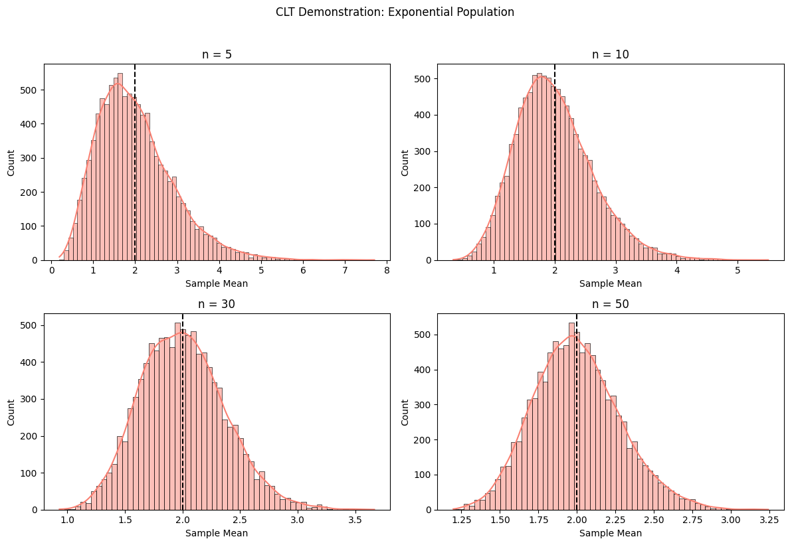
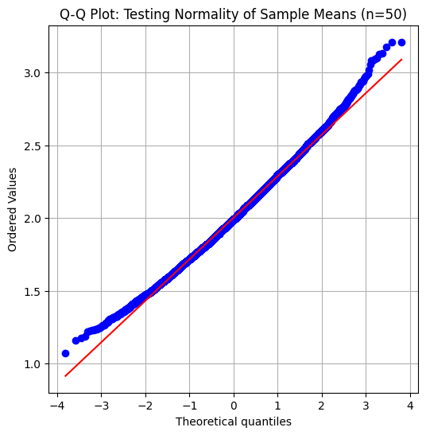

# Problem 1

**1. Theoretical Foundation of the Central Limit Theorem (CLT)**

The Central Limit Theorem (CLT) is a fundamental concept in probability theory and statistics, stating that:

"Given a sufficiently large sample size n, the sampling distribution of the sample mean $\overline{X}$ will approximate a normal distribution, regardless of the population's original distribution."

**Mathematical Formulation**

For a population with:

- Mean $\mu$

- Variance $\sigma^2$

The sampling distribution of the sample mean $\overline{X}$ will have:

Mean: $\mu_{\overline{X}} = \mu$

Standard Error (SE): $\sigma_{\overline{X}} = \frac{\sigma}{\sqrt{n}}$

As $n→∞$ , the distribution of $\overline{X}$ converges to:

$$\overline{X} \sim N\left(\mu, \frac{\sigma^2}{n}\right)$$

**2. Simulation Methodology**

**Step 1: Define Population Distributions**

We examine three distinct distributions:

**Uniform Distribution**

$$X∼Uniform(a,b)$$

- $\text{Mean: } \mu = \frac{a+b}{2}$

- Variance: $\sigma^2 = \frac{(b-a)^2}{12}$

**Exponential Distribution**

$$X∼Exp(λ)$$

- $\text{Mean: } \mu = \frac{1}{\lambda}$

- $\text{Variance: } \sigma^2 = \frac{1}{\lambda^2}$

**Binomial Distribution**

$$X∼Binomial(n,p)$$

- $\text{Mean: } \mu = np$

- $\text{Variance: } \sigma^2 = np(1-p)$

**Step 2: Generate Sampling Distributions**

For each population:

Draw $k$ random samples of size $n$.

Compute the sample mean $\overline{X}$ for each sample.

$\text{Repeat for increasing } n \text{ (e.g., } n=5, 10, 30, 50)$

**Step 3: Analyze Convergence to Normality**

For small $n$, the sampling distribution resembles the population.

For large $n$, it converges to a Gaussian distribution.

**Key Observations**

**$(A)$ Impact of Sample Size $(n)$**

- Small n (e.g., 5):

Sampling distribution retains shape of the population.

Exponential → Right-skewed, Binomial → Discrete.

- Large n (e.g., 50):

All distributions converge to a symmetric bell curve.

**(B) Role of Population Variance $({\sigma^2})$**

Higher variance widens the sampling distribution:

$$\sigma_{\overline{X}} = \frac{\sigma}{\sqrt{n}}$$

$\text{Uniform (low } \sigma^2 \text{): Faster convergence.}$

$\text{Exponential (high } \sigma^2 \text{): Requires larger } n$

**Practical Applications of CLT**

**(1) Estimating Population Parameters**

- Example: Polling (sample mean $\overline{X}$ approximates $μ$).

- Confidence Intervals:

$$X \pm z \cdot \frac{\sigma}{\sqrt{n}}$$

**(2)Quality Control (Manufacturing)**

- Control Charts: Monitor if process means remain within $\mu \pm 3 \frac{\sigma}{\sqrt{n}}$

**(3) Financial Risk Modeling**

- Portfolio Returns: Sum of asset returns → Normal distribution (CLT).

**Limitations and Extensions**

**When CLT Fails**

- Heavy-Tailed Distributions (e.g., Cauchy): No finite variance → No CLT.

- Extremely Small n: Non-normal sampling distribution.

**Advanced Considerations**

- Berry-Esseen Theorem: Quantifies convergence speed.

- Multivariate CLT: Extends to vector-valued distributions.

**Visualizing the CLT (Conceptual Plots)**

**Expected Simulation Outputs**

**Histograms of $\overline{X}$ for Increasing n**

- Left: Original population (e.g., exponential).

- Right: Sampling distribution (becoming Gaussian).

**Q-Q Plots**

Confirms normality by comparing quantiles to $N(0,1)$

**Convergence Animation**

- Dynamic plot showing distribution evolving with $n$.

**Conclusion**

The CLT bridges theory and practice, enabling:

- Reliable inference from samples.

- Simplified modeling of complex systems.

- Robust decision-making in uncertain environments.

**Graphic Examples**

**Convergence of Sample Means (Uniform Distribution)**

**CLT for Skewed Data (Exponential Distribution)**

**Q-Q Plot for Normality Check**

