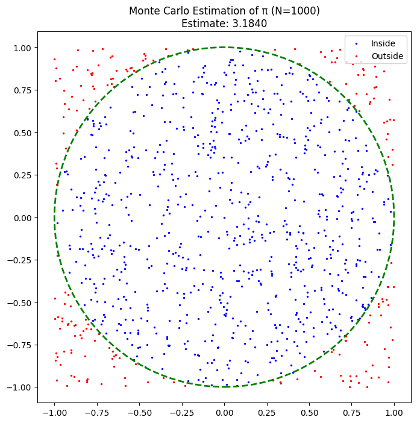
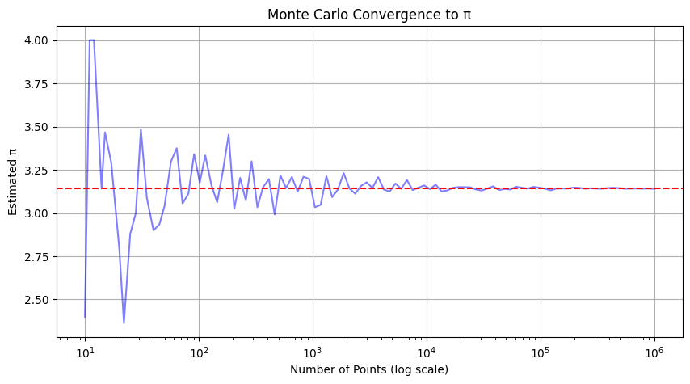
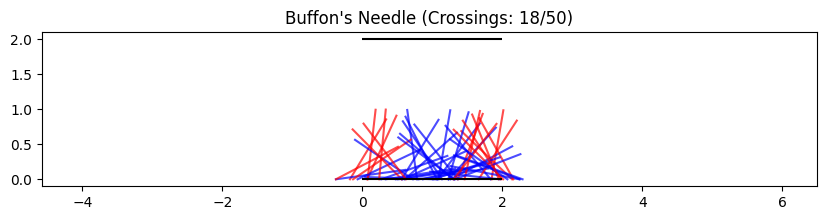

# Problem 2

**Estimating π Using Monte Carlo Methods**

**Introduction to Monte Carlo Methods**

Monte Carlo methods are computational algorithms that rely on repeated random sampling to approximate numerical results. They are particularly useful for problems where analytical solutions are difficult or impossible to derive. One classic application is estimating the value of $π$ using geometric probability.

**Part 1: Estimating $π$ Using a Circle**

**Theoretical Foundation**

Consider a unit circle (radius = 1) inscribed inside a square with side length = 2.

**Area of the circle:**

$$A_{\text{circle}} = \pi r^2 = \pi (1)^2 = \pi$$

**Area of the square:**

$$A_{\text{square}} = (2)^2 = 4$$

**Ratio of areas:**

$$\frac{A_{\text{circle}}}{A_{\text{square}}} = \frac{\pi}{4}
$$

If we randomly scatter points uniformly inside the square, the probability that a point lands inside the circle is:

$$P(\text{inside circle}) = \frac{\pi}{4}$$

Rearranging, we estimate:

$$\pi \approx 4 \times \left( \frac{\text{Number of points inside circle}}{\text{Total points}} \right)$$

**Simulation Steps**

- Generate random points $(x,y)$ where $x,y$ $∈$ $[−1,1]$.

- Count points where $x^2 + y^2 ≤ 1 $ (inside the circle).

- Compute the ratio and multiply by $4$ to estimate $π$.

**Convergence Analysis**

- Accuracy improves with more points (Law of Large Numbers).

- Error decreases proportionally to $\frac{1}{\sqrt{N}}$ (Monte Carlo convergence rate).

**Visualization**

A scatter plot of points inside (blue) and outside (red) the circle illustrates the method.

**Part 2: Estimating π Using Buffon’s Needle**

**Theoretical Foundation**

Buffon’s Needle is a probability experiment where a needle of length $L$ is dropped onto a plane with parallel lines spaced distance 
$D$ apart.

**Probability of crossing a line:**

$$P(\text{cross}) = \frac{2L}{\pi D}$$

Solving for 
$π$:

$$\pi \approx \frac{2L \cdot N}{D \cdot C}$$

where:

N = Number of needle drops

C = Number of crossings

**Simulation Steps**

Randomly generate needle positions (midpoint 
$x$, angle $θ$).

Check if the needle crosses a line:

$\text{A needle crosses if } x \pm \frac{L}{2} \sin \theta \text{ exceeds } D.$

Estimate 
$π$ using the formula above.

**Convergence Analysis**

- Slower convergence than the circle method due to lower efficiency.

- Optimal setup: 
$L=D$ maximizes accuracy.

**Visualization**

A plot of needles (lines) overlaid on parallel grid lines highlights crossings.

**Practical Implications**

Circle Method: Used in high-performance computing for benchmarking.

Buffon’s Needle: Demonstrates geometric probability in classrooms.

**Limitations and Extensions**

**Limitations:**

- Both methods require many iterations for high precision.

- Buffon’s Needle is sensitive to 
$L/D$ ratio.

**Extensions:**

3D Monte Carlo: Estimate π using sphere-cube volume ratios.

Importance Sampling: Reduce variance in estimations.

**Graph Exxamples**

**Visualizes the proportion of points inside/outside the unit circle**

**Demonstrates how accuracy improves with more points**

**Shows needle drops and line crossings**

**Conclusion**

Monte Carlo methods provide intuitive yet powerful ways to estimate $π$:

The circle method is efficient and widely used.

Buffon’s Needle offers historical and educational insights.

Both methods highlight how randomness can solve deterministic problems, bridging geometry, probability, and computation.

