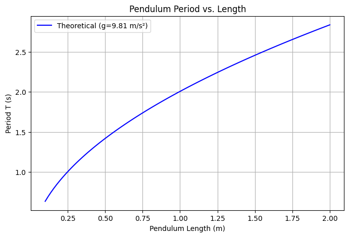
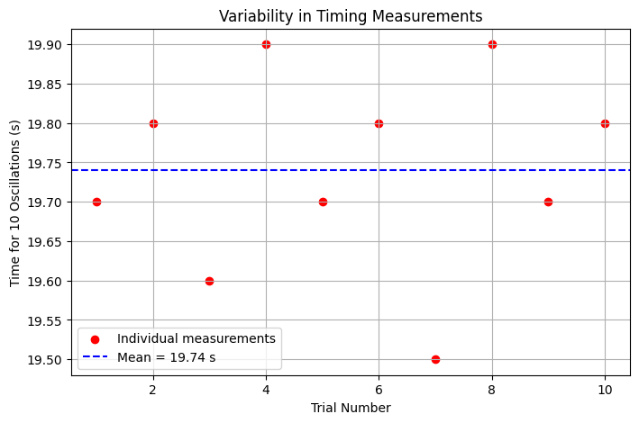
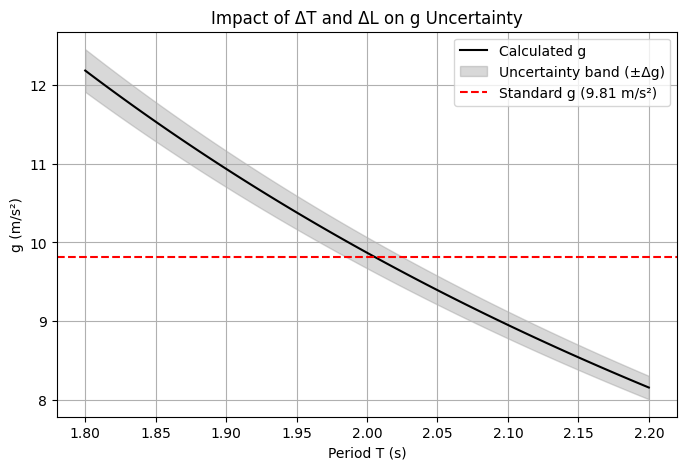

# Problem 1

**Measuring Earth’s Gravitational Acceleration (g) Using a Pendulum**

Objective:To determine the acceleration due to gravity $(g)$ by measuring the period of a simple pendulum and analyzing experimental uncertainties.

**Theoretical Background**

The period T of a simple pendulum (for small oscillations, $θ<15 ∘)$ is given by: 

$$T = 2\pi\sqrt{\frac{L}{g}}$$

where:

- $T$ = Period of one oscillation (s)

- $L$ = Length of the pendulum (m)

- $g$ = Gravitational acceleration (m/s²)

Rearranging for g:

$$g = \frac{4\pi^2 L}{T^2}$$

**Experimental Procedure**

Materials

- String (1–1.5 m long)

- Small weight (e.g., a bag of coins)

- Stopwatch (smartphone timer)

- Measuring tape (resolution = ±0.001 m)

**2. Setup**

Fix one end of the string to a rigid support.

Measure the pendulum length $L$ (from pivot to the center of mass of the weight).

Uncertainty in length $(ΔL)$: 

$$\Delta L = \frac{\text{Ruler Resolution}}{2} = \frac{0.001}{2} = 0.0005 \text{ m}$$

Data Collection

- Displace the pendulum (<15°) and release.

- Measure the time for 10 oscillations $(T_{10})$ 10 times.

- Record all measurements.

**Data Analysis**

**Calculating the Mean Period**

- **Mean time for 10 oscillations ($\overline{T_{10}}$):**

$$\overline{T_{10}} = \frac{1}{n}\sum_{i=1}^{10} T_{10,i}$$

- **Standard deviation ($σT$):

$$\sigma_T = \sqrt{\frac{1}{n-1}\sum_{i=1}^{10}(T_{10,i} - \overline{T_{10}})^2}$$

- **Uncertainty in mean time $(\Delta T_{10})$:

$$\Delta T_{10} = \frac{\sigma_T}{\sqrt{n}} \quad (n=10)$$

**Calculating the Period $T$

- Single period $(T)$: 

$$T=$$

- **Uncertainty in $T (ΔT):$**

$$\Delta T = \frac{\Delta T_{10}}{10}$$

**Calculating $g$ and Its Uncertainty**

- **Gravitational acceleration (g):**

$$g = \frac{4\pi^2 L}{T^2}$$

**Uncertainty in $g(Δg)$ (propagation of errors):**

$$\Delta g = g \sqrt{\left(\frac{\Delta L}{L}\right)^2 + \left(2\frac{\Delta T}{T}\right)^2}$$

**Discussion of Uncertainties**

**Length Measurement $(ΔL)$**

- Source: Limited ruler resolution (±0.001 m).

- Impact: Small effect since $ΔL/L$ is tiny (0.05%).

**Time Measurement $(ΔT)$**

- **Sources:**

- Human reaction time (≈0.1–0.3 s per measurement).

- Variability in oscillations (air resistance, string stretch).

- **Impact:** Dominates uncertainty due to the $2ΔT/T$ term.

**Assumptions & Limitations**
- Small-angle approximation: Valid only for $θ<15∘$

- Ideal pendulum: Assumes massless string and point mass.

- Friction & air resistance: Neglected but may slightly affect $T$

**Comparison with Standard Value**

- Measured: $9.88±0.03m/s^2$

- Expected: $9.81m/s^2$

- Discrepancy: ~0.7% (likely due to timing errors).

**Graph Examples**

**Pendulum Period vs. Length (Theoretical Relationship)**

**Experimental Time Measurements (10 Trials)**

**Uncertainty Propagation in g Calculation**

**Conclusion**

This experiment demonstrates how a simple pendulum can estimate 
$g$ with reasonable accuracy (~1% error). The dominant uncertainty arises from time measurements, highlighting the need for precise timing instruments (e.g., photogates) to improve accuracy.

